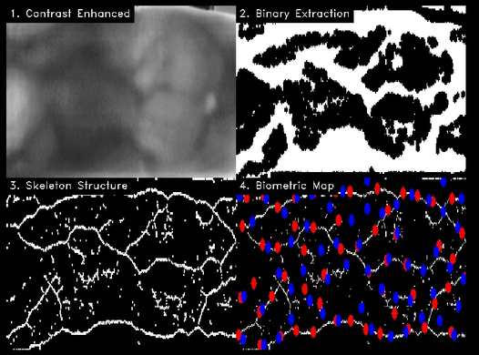

# VeinMapper

**VeinMapper** is a Python application we built to process raw infrared images and visualize finger vein patterns. We developed this tool to enhance low contrast biometric images, extract vein structures, and map key geometric points using computer vision.

The system runs on a Flask server and renders the analysis in a real time web browser dashboard.

### Motivation

Our work is motivated by the real world challenges in locating veins for medical procedures. We found research indicating that peripheral IV catheter insertion has a failure rate of **35% to 50%**, often due to the difficulty of visualizing veins in patients. This project serves as a proof of concept for using computer vision to automatically detect and map subcutaneous veins to hopefully improve these outcomes in the future.

### Technical Implementation

The code relies on **OpenCV** for image manipulation and **NumPy** for matrix operations. We split the logic into four specific processing steps.

**Contrast and Enhancement**
- We use **CLAHE** (Contrast Limited Adaptive Histogram Equalization) to fix lighting inconsistencies. Since raw    infrared images are often dark or uneven, this step locally adjusts intensity in 8x8 pixel grids to make the      veins distinct from the skin.

**Segmentation and Masking**
- To separate the veins from the background, we apply **Adaptive Gaussian Thresholding**. This calculates           thresholds based on neighboring pixels rather than a global value. We also generate a binary mask using           contours to identify the finger shape, ensuring we only process the relevant area and ignore the black borders.

**Skeletonization**
- We implemented a custom iterative loop to thin the veins. The code repeatedly erodes the binary image and         subtracts the result from the previous step. This process continues until the veins are reduced to a single       pixel width, creating a clean "skeleton" of the network.
  
**Feature Detection**
- The system analyzes the skeletonized image to find geometric nodes. We count the neighbors of every white pixel   to determine if it is an endpoint (1 neighbor) or an intersection (3 or more neighbors). We then filter these     points using a Euclidean distance check to prevent clustering.

### Web Interface

 The project uses **Flask** to serve the results. The backend generates a tiled dashboard that combines the        Enhanced, Binary, Skeleton, and Final Map images into a single view. The interface includes API endpoints to      fetch dataset statistics and navigation controls to cycle through patient files.

### Dataset

- We tested the code using the **Kaggle Finger Vein Dataset**, which provides the necessary infrared samples for    calibration.
[Source: Kaggle Finger Vein Dataset](https://www.kaggle.com/datasets/ryeltsin/finger-vein)
